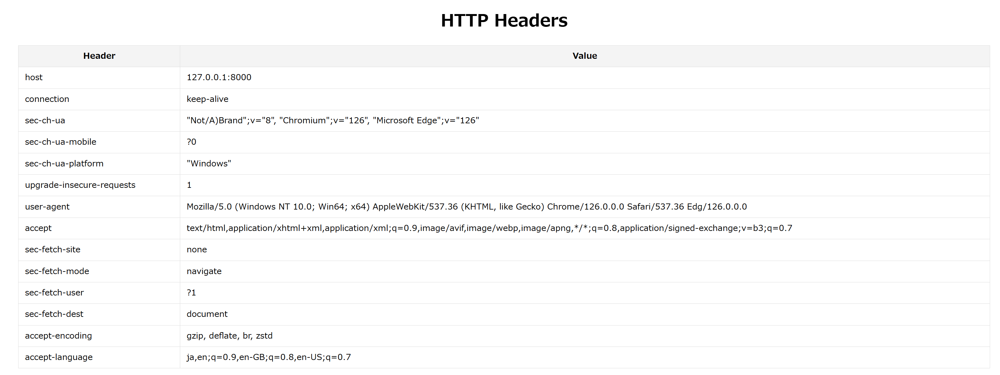

# headerbase-sso-for-fastapi

This is an application that visualizes HTTP header information in a list.

## Installation
1. python3 -m venv venv
2. source venv/bin/activate
3. pip install -r requirements.txt
4. uvicorn main:app --reload 
   uvicorn main:app --host 0.0.0.0 --port 80 --reload
